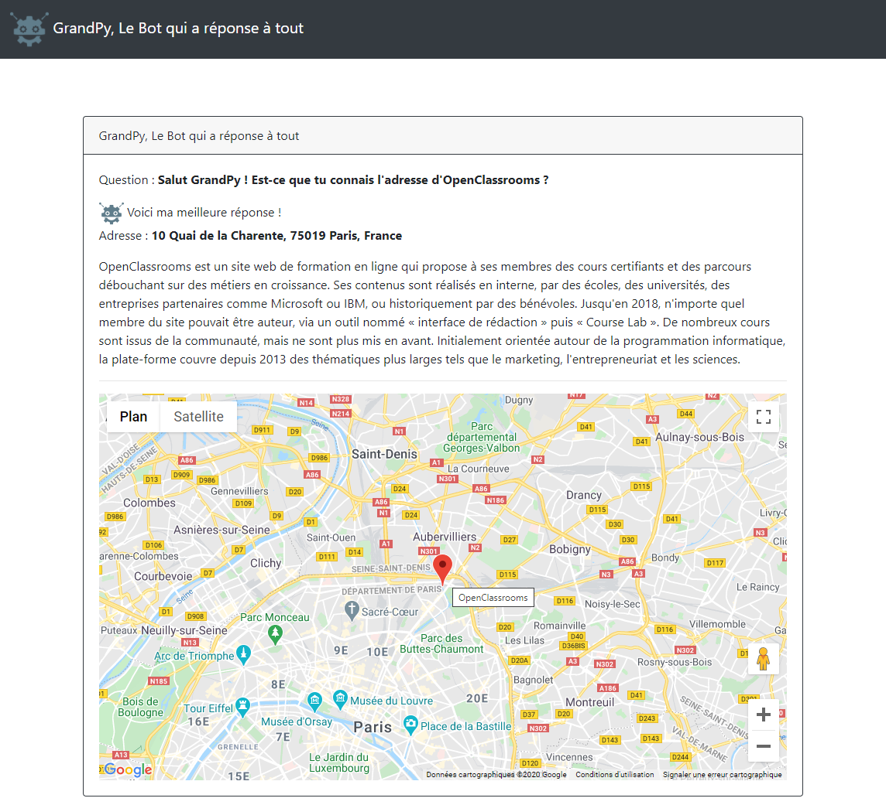
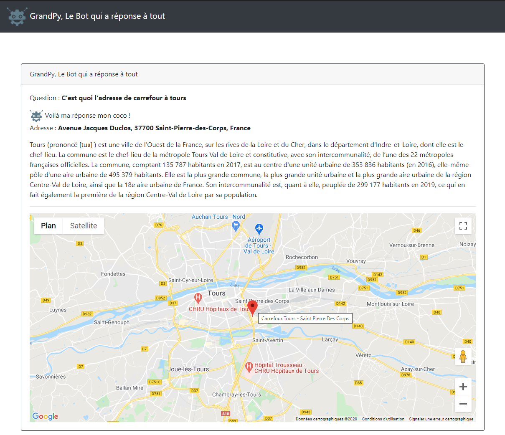
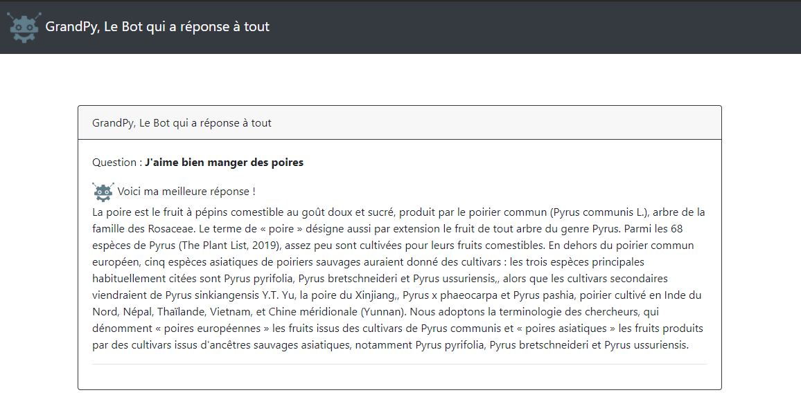
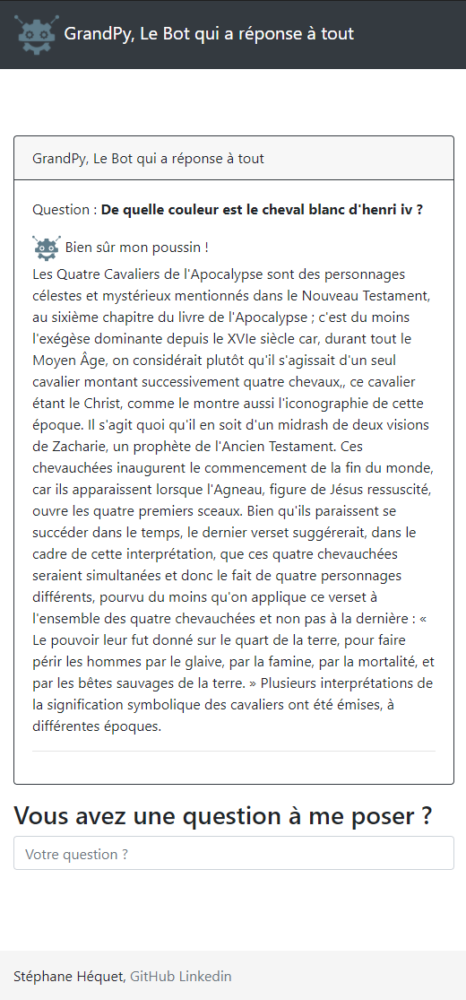

# GrandPyBot


### Installation

Après avoir créé un virtual env, installez les dépendances via le requirements.txt

```shell
pip install -r requirements.txt
```

### Configuration

Ajouter dans les variables d'environnement :

Clé de l'API google pour la carte en JavaScript
```
GOOGLE_API_MAP_KEY=SECRET_KEY
```

Clé de l'API google pour la partie recherche
```
GOOGLE_API_PLACE_KEY=SECRET_KEY
```


### Démarrer le serveur Web Flask en mode développeur
```shell
python run.py
```

```shell
 * Serving Flask app "botapp.views" (lazy loading)
 * Environment: production
   WARNING: This is a development server. Do not use it in a production deployment.
   Use a production WSGI server instead.
 * Debug mode: on
 * Restarting with stat
 * Debugger is active!
 * Debugger PIN: 306-212-104
 * Running on http://127.0.0.1:5000/ (Press CTRL+C to quit)
```

### Lancer les tests
```shell
python -m pytest
```

### Démo en ligne sur herokuapp

https://evening-citadel-75590.herokuapp.com

### Exemple recherche : Salut GrandPy ! Est-ce que tu connais l'adresse d'OpenClassrooms ?


### Exemple recherche : C'est quoi l'adresse de carrefour à tours ?


### Exemple recherche : J'aime bien manger des poires


### Exemple recherche : De quelle couleur est le cheval blanc d'henri iv ?
